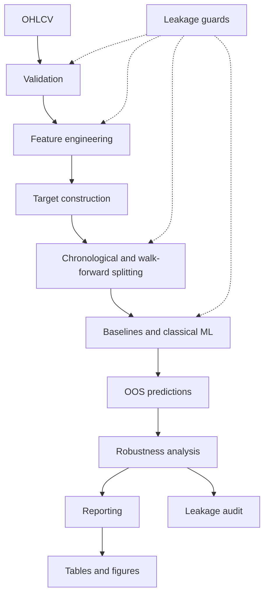
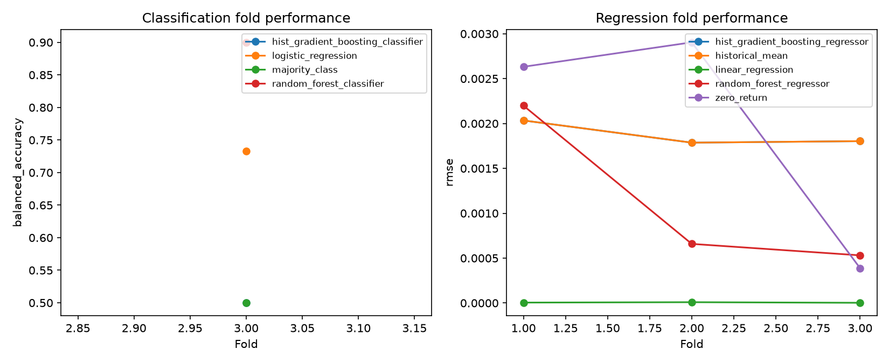
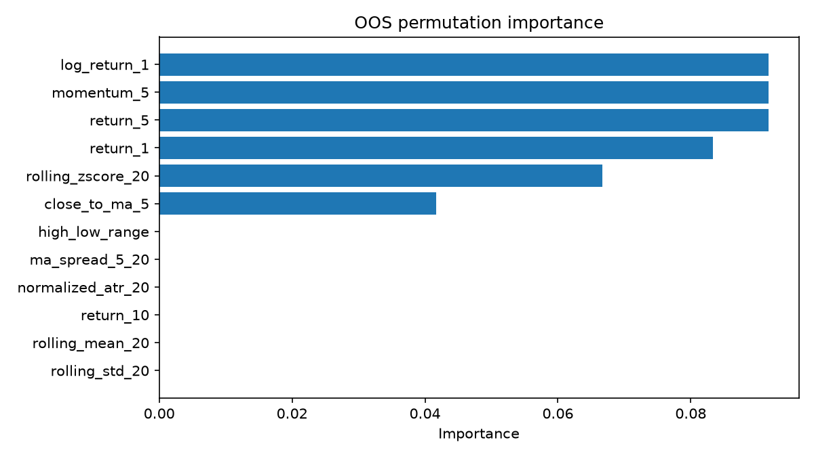
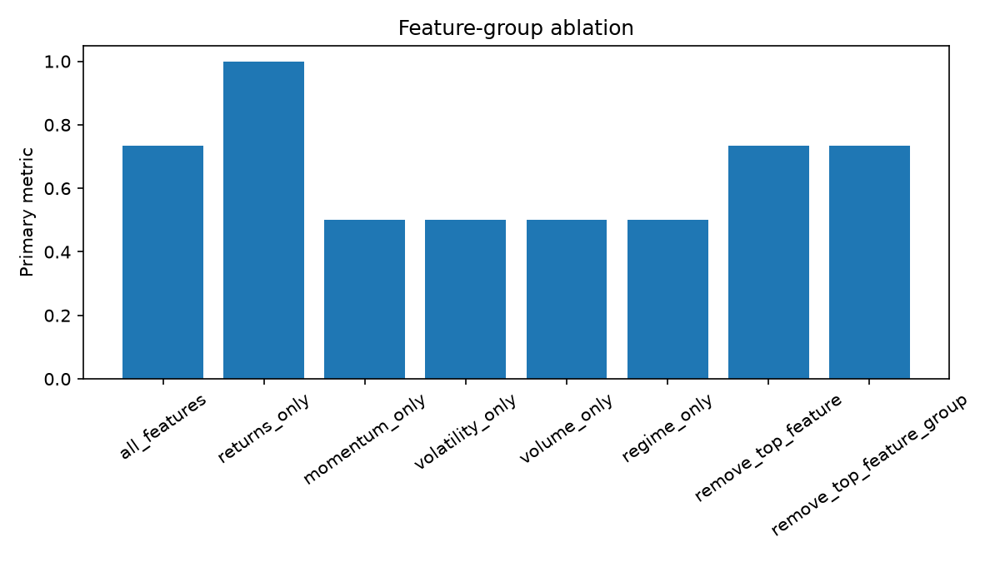
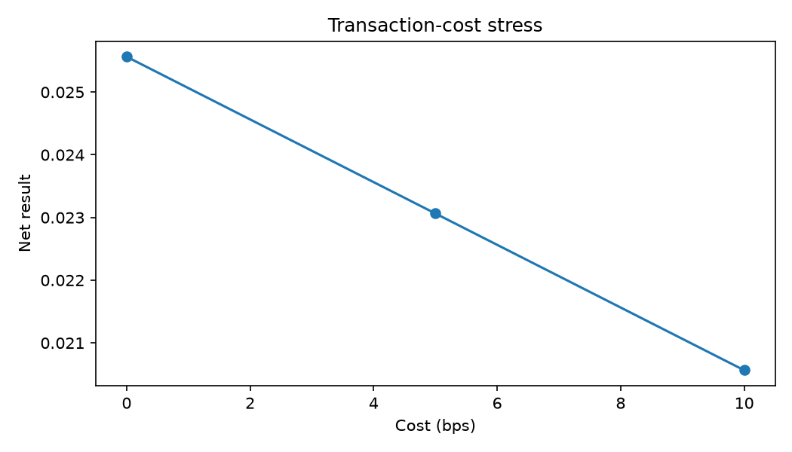

# AlphaForge

**Leakage-safe quantitative ML research framework for testing predictive signals in financial time series.**

AlphaForge asks whether interpretable OHLCV-derived features predict short-horizon returns or direction better than simple baselines. It demonstrates Python, statistics, feature engineering, classical ML, time-series validation, leakage prevention, robustness testing, and reproducible reporting.

> **Final verdict: NO PERSISTENT SIGNAL.** The repository validates a rigorous research workflow, but it does not establish a stable predictive edge or tradable profitability. Saved figures use deterministic synthetic verification data, not empirical market evidence.

## Research question

Can recent returns, momentum, volatility, volume behavior, rolling statistics, and simple regime labels outperform naive statistical baselines on truly unseen future observations?

A negative result is scientifically valid: it prevents an unstable or configuration-dependent pattern from being mislabeled as alpha.

## Stack

Python 3.12+, NumPy, pandas, SciPy, scikit-learn, matplotlib, and pytest.

## Methodology

1. Validate and chronologically order OHLCV bars.
2. Compute trailing, interpretable features and separately aligned forward targets.
3. Compare majority, persistence, zero-return, historical-mean, and linear baselines with logistic regression and tree ensembles.
4. Refit preprocessing and models inside horizon-purged expanding or rolling walk-forward folds.
5. Retain only unseen OOS predictions and evaluate fold stability.
6. Stress results through importance, ablation, horizon/window/regime sensitivity, fixed thresholds, costs, and train–OOS gaps.
7. Audit leakage and residual research risks before drawing a conclusion.

## Feature summary

| Group | Purpose |
|---|---|
| Returns | Represent recent simple and logarithmic price changes. |
| Momentum | Test whether recent direction or moving-average relationships persist. |
| Volatility | Represent changing dispersion, range, and normalized true range. |
| Volume | Test whether relative activity or abrupt volume changes add information. |
| Rolling statistics | Standardize current price behavior against trailing local history. |
| Regime labels | Slice results by simple trailing volatility and trend states without treating them as definitive regimes. |

## Models

**Classification baselines:** majority class, recent-return-direction persistence, logistic regression.

**Regression baselines:** zero return, historical mean, linear regression.

**Classical ML:** Random Forest and Histogram Gradient Boosting classifiers and regressors.

Classical models were chosen before deep learning because the feature set is tabular, interpretable, and modest. They provide nonlinear capacity while keeping leakage audits and model comparisons tractable.

## Leakage controls

- No random splitting or shuffled rows.
- No centered rolling windows or target-derived features.
- Scaling and model fitting occur independently on each training fold.
- Prediction-horizon rows are purged at train/evaluation boundaries.
- Evaluation observations never influence training.
- OOS predictions are unique by model, target, and timestamp.
- Suspiciously strong results trigger warnings and renewed audit.

See [PHASE5_AUDIT.md](PHASE5_AUDIT.md) for the explicit leakage and research-risk audit.

## Architecture



## Results

**NO PERSISTENT SIGNAL.** Existing evidence does not demonstrate a stable predictive edge. Results remain sensitive to data and configuration, and no external lockbox replication exists. Therefore, AlphaForge makes no alpha, profitability, or deployment claim.

The checked-in plots verify the reporting path using synthetic bars:









Read the full [research report](RESEARCH_REPORT.md) and short [executive summary](EXECUTIVE_SUMMARY.md).

## Testing and reproducibility

```bash
python -m venv .venv
# Activate the environment for your shell, then:
python -m pip install -e ".[dev]"
python -m pytest
python -m alphaforge.reporting
```

The reporting command reads saved CSV artifacts and regenerates figures without rerunning model experiments. Verification artifact provenance is documented in [reports/README.md](reports/README.md).

## Project structure

```text
src/alphaforge/     Data, features, targets, models, evaluation, robustness, reporting
tests/              Leakage, boundary, metric, model, robustness, and reporting tests
reports/tables/     Machine-readable verification outputs
reports/figures/    Static report figures
scripts/            Explicit verification-artifact generation
```

## Limitations

- No external real-market lockbox replication or broad asset coverage.
- Survivorship, corporate-action, and vendor-quality risks remain data-source responsibilities.
- Multiple testing and informal researcher iteration can still bias conclusions.
- Transaction costs are a simple sensitivity calculation, not an execution model.
- Regime labels are descriptive and configuration-dependent.
